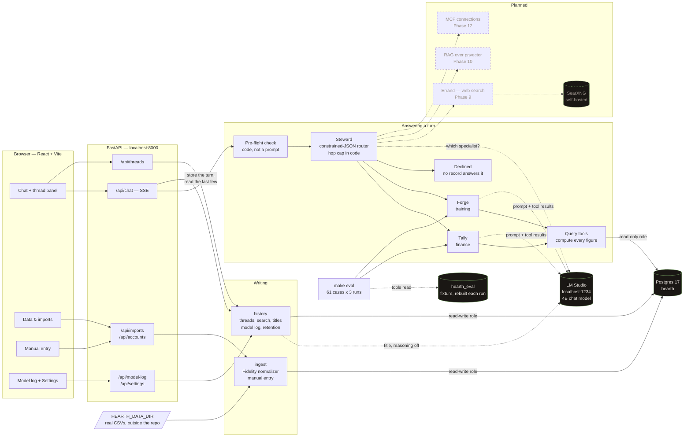
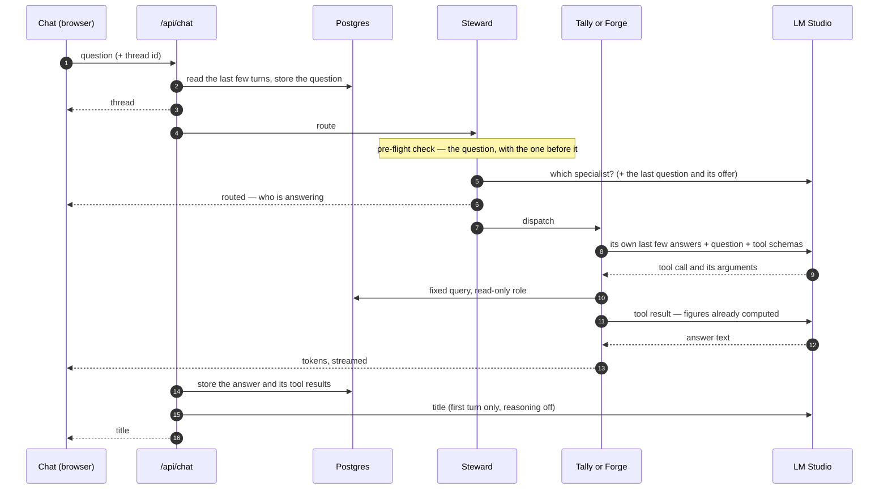

# Hearth

A local-first personal assistant. An orchestrator routes each turn to a specialist agent
working over my own data. Everything runs on my machine.

The rules that govern this codebase are in [CLAUDE.md](CLAUDE.md) — several of them are
inviolable rather than preferred. The phase plan is in [docs/plan.md](docs/plan.md).

**Status: Phases 0–8 and 11 complete; 9, 10 and 12 to go.** Ask a question and the
**Steward** routes it to a specialist — **Tally** for finances, **Forge** for training — or
declines it when no record can answer it. The answer streams back with the figure the tool
computed, to the cent, and coverage gaps stated before the trend. Conversations are stored
and searchable. Fidelity positions exports import from a folder outside the repo, and
the first real one matched Fidelity's totals to the cent.

You do not say which specialist you want. Routing is a constrained-JSON classifier and it
is measured: 60/60 on a 20-case labelled set, every case unanimous across three runs.

## Architecture

Everything below runs on one machine. The only planned exception is Errand's web search
(Phase 9), which will pass an egress filter and be logged.



Two roles reach the database, and the split is structural rather than a convention. Every
figure the model sees comes through the **read-only role**; the model never writes SQL, and
the connection it reads through could not write if it did. Only `ingest` and `history`
hold the read-write connection, and no tool can reach either.

One turn, end to end:



The model never does arithmetic and never sees raw records: step 11 hands it figures a
Python function already computed and rounded, and the evals assert that exact figure
appears in the answer.

## Guardrails

CLAUDE.md's rules are enforced in code, not asked for in prompts (rule 7). Each row names
where a rule is enforced and the test that proves it. A rule that exists only as prompt
text is not in this table, because it is not implemented.

| Rule | Enforced by | Proven by |
|---|---|---|
| **Nothing harmful reaches a model** — self-harm, hate speech, disordered eating | `agents/preflight.py`, run before the Steward's router and again in each specialist. On a follow-up it reads the new question together with the earlier ones that model will see, so a request split across turns ("help me lose 10kg" / "in 2 weeks") is refused. A refused question is never sent to any model — not as a turn, not as a title, not later as context. Self-harm gets a reply pointing to 988; hate speech is declined in one line | `tests/test_preflight.py` (113 cases in both directions, including money and gym idioms that must pass), `tests/test_guardrails.py` (every entry point refuses with every model constructor rigged to fail, split requests included), `tests/test_conversation.py` (all 1,681 pairs of allowed questions still pass together) |
| **1. The model never does arithmetic** | Tools compute every figure; `agents/grounding.py` checks every dollar amount and weight in every answer against the numbers its tools returned, and flags any that no tool produced — shown under the answer and stored with it. A figure repeated on a follow-up counts only if an earlier turn's *tool* returned it, never because an earlier answer said it | `tests/test_grounding.py`, `tests/test_chat_route.py`, `tests/test_threads_route.py`; the evals fail a grounded or caveat case on any ungrounded figure |
| **Context is scoped and capped** | `agents/conversation.py`: a follow-up carries at most 3 earlier exchanges and 4,000 characters of them, whole or not at all. Each specialist sees only its own answers — Forge never reads a balance — and the router only the last question and the last line of its answer. Earlier tool results are never sent back | `tests/test_conversation.py` |
| **2. The model never writes SQL** | Fixed parameterized query functions, run through a read-only Postgres role | `tests/test_readonly_role.py` — the role provably cannot write |
| **3. No live financial connections** | Data enters by CSV from `HEARTH_DATA_DIR` or by hand. The API takes a file name, never a path or an upload; the folder must be outside the repo | `tests/test_datadir.py`, `tests/test_data_routes.py` |
| **4. No account numbers** | No column for one. Imports refuse an account-number column, and any account name, filename or label with four digits in a row, before anything is stored. Errors mask digits | `tests/test_schema.py`, `tests/test_fidelity.py`, `tests/test_manual_entry.py` |
| **5. Nothing leaves the machine** | Every configured address — model, database, search — must be loopback, private or LAN, or startup fails (`config.local_only`). The one planned exception, Errand's search, arrives with its own egress filter in Phase 9 | `tests/test_config.py` |
| **6. No telemetry** | The model connection refuses to build while any tracing variable is on | `tests/test_llm_connection.py` |
| **7. Iteration caps** | The Steward's hop cap is a conditional edge (6); the specialist loop stops at 4 model calls | `tests/test_steward.py`, `tests/test_guardrails.py` |
| **The Model log stays on this machine** | Every prompt and reply — balances included — is kept in Postgres, keyed to its question and deleted with its thread, and after 90 days by default. No export, no tracing service: Langfuse is not wired (it would need Docker here, and its cloud is ruled out by rules 5 and 6) | `tests/test_model_log.py`, `tests/test_preferences.py` |
| **No setting loosens a guardrail** | `preferences.py`: three preferences, each a fixed list of values — answer length and two retention periods. The hop cap, step cap, follow-up window, pre-flight check and read-only role are shown on the Settings screen locked, and `.env` is never written from a page | `tests/test_preferences.py` |
| **Real data stays out of the repo** | `HEARTH_DATA_DIR` inside the repository is refused; the evals run on their own fixture database, so no real figure reaches a committed result file | `tests/test_datadir.py`, `evals/conftest.py` |

Rules 8–11 govern MCP, which arrives in Phase 12; no MCP code exists yet.

## Roadmap

Effort was sized in evenings; the full reasoning for each phase, including what each
measurement found, is in [docs/plan.md](docs/plan.md).

| Phase | What | Status | Exit criterion → result |
|---|---|---|---|
| 0 | Scaffold | Done | `/health` serves, Vite runs |
| 1 | Data layer: schema, read-only role, golden fixture | Done | Migrations go up and down; the read-only role provably cannot write |
| 2 | Ingestion: Fidelity positions import, manual entry | Done — **verified on a real export**, totals match Fidelity's | The same file twice is a no-op; a malformed file writes nothing, even after its raw rows were stored |
| 3 | Query and compute tools | Done | Every tool tested, partial coverage included |
| 4 | Model connection | Done | Constrained JSON schema-valid 10/10 → **30/30** |
| 5 | Tally, end to end | Done | Net worth exact to the cent with the coverage gap stated → **3/3** |
| 6 | Steward and routing | Done | Routing ≥ 90% → **60/60**; a delegation loop stops at 6 hops |
| 7 | Eval harness | Done | A prompt edit moves a number → caveat cases 3/3 → 0/3 → 3/3; baseline **47/47, 141/141** |
| 8 | Thread history and follow-ups | Done | Last week's thread found by a word you remember → found by "squat" and by "squatting"; "yes" to an offer is understood |
| 9 | Errand and egress (web search) | **Blocked** — SearXNG needs Docker or a native install | A prompt engineered to leak a balance into a search raises `EgressViolation` |
| 10 | RAG over documents | **Blocked** — pgvector needs an MSVC build | Retrieval traceable per answer; context stays within budget |
| 11 | Forge (training) | Done over the fixture; real fitness data source open | Refusal path tested → pre-flight check now runs before routing, on every question |
| 12 | MCP connections | Not started | Tool-schema cost visible and under a ceiling; no remote server |

Open, in the order they matter:

1. **Fitness data source** — an app export, or manual entry (Phase 11 runs on the fixture).
2. **SearXNG without Docker** (Phase 9) and **pgvector on Windows** (Phase 10).

Cut deliberately: voice, a third agent, proactive alerts, multi-model routing and
transaction-level ingestion — each for a reason the plan records. Built from the backlog:
the **Model log** and **Settings** screens. Langfuse is blocked on Docker, like SearXNG.
Backlog, unscheduled: a morning digest, and CSV and chart export.

## Prerequisites

- Python 3.12. On the Mac, `uv python install 3.12` provides it without sudo or Homebrew;
  make sure the shim directory (`~/.local/bin`) is on your PATH, or point the Makefile at
  it with `make PYTHON=/full/path/to/python3.12`. On the Windows host use `py install
  3.12`, which registers it with the `py` launcher the Makefile already calls — a
  uv-managed interpreter is invisible to `py -3.12`.
- GNU make. Present on the Mac; on the Windows host, `winget install ezwinports.make`
  (winget does not add it to its Links directory, so add its `bin` to PATH by hand).
- Node 20.19+ or 22.12+ (Vite 7's floor)
- Docker with Compose v2 — **or** a native Postgres 17, see
  [Postgres without Docker](#postgres-without-docker)
- [LM Studio](https://lmstudio.ai) serving an OpenAI-compatible endpoint on
  `http://localhost:1234/v1`

The hardware target is an RTX 4060 Ti with **8GB of VRAM**, shared between the chat model
and the embedding model. Nothing larger than ~8B at Q4 fits. The 8,192-token context
window, not disk or RAM, is the scarce resource.

**Hearth is developed on a Mac and hosted on the RTX 4060 Ti machine.** The data layer,
ingestion and query tools are ordinary portable software and are built on either. Anything
model-dependent is only meaningful on the host: the Phase 4 smoke test, and every eval
pass rate. A pass rate measured anywhere else does not characterise the target, and
`make freeze` produces a lockfile for one machine's architecture, not both.

## Setup

```bash
cp .env.example .env     # then fill it in — see below
make install             # creates .venv, installs both toolchains
make up                  # Postgres + SearXNG, both bound to 127.0.0.1
make dev                 # infrastructure + backend + frontend
```

`make dev` serves the API on `http://localhost:8000` and the UI on
`http://localhost:5173`. The UI reaches the API through Vite's dev proxy, so the two share
an origin and there is no CORS layer to configure.

Check the backend directly:

```bash
curl http://localhost:8000/health
```

### Filling in `.env`

Most of it is local connection details. Two entries deserve attention:

- **`SEARXNG_SECRET`** — generate with `openssl rand -hex 32`. SearXNG will not start
  without it.
- **`CHAT_MODEL` and `EMBEDDING_MODEL`** — the model ids LM Studio reports. There are no
  defaults in code, deliberately: a default model name in Python is a hardcoded model
  name, and these change. The inference layer refuses to start without them; the API and
  `/health` do not depend on them.

`.env` is gitignored and is never read into an assistant session.

## Postgres without Docker

The GPU host has no working Docker: Docker Desktop is installed but its WSL2 engine fails
with `Virtual Machine Platform not enabled`, and the WSL2 route contradicts the no-WSL
decision this project already made. So that machine runs a native cluster instead, and
`make up`, `make down` and `make logs` drive `pg_ctl` rather than compose whenever `PGDATA`
is set in `.env`. With it unset, everything behaves as before.

Setting one up needs neither an installer nor admin rights — the PostgreSQL Windows
**binary zip** is just files:

```bash
# extract the zip, then, with $PGBIN on PATH:
initdb -D <PGDATA> -U hearth --auth-host=scram-sha-256 --pwfile=<file>   # then delete the file
make up                                                                  # pg_ctl start
createdb -h 127.0.0.1 -U hearth hearth
make migrate && make seed && make test
```

`hearth` is the bootstrap superuser, which is what `POSTGRES_USER` made it inside the
container — the arrangement is the same, minus the container. The cluster listens on
127.0.0.1 only, matching the compose file's binding.

Two things you do not get, both deliberate rather than overlooked:

- **pgvector.** It is not in the zip and building it on Windows needs an MSVC toolchain.
  Nothing before Phase 10 stores a vector — no migration, model or query tool references
  one — so the test harness warns and continues rather than failing fifty unrelated tests.
  Phase 10 must install it and assert it is there.
- **SearXNG.** It is a compose service, so Phase 9 needs either a working Docker or a
  native SearXNG.

A native cluster is not a service and does not survive a reboot. `make up` starts it.

## What the tools do

Five functions, all pure Python over fixed parameterized queries, all running as the
read-only role. Each is exposed to exactly one agent (CLAUDE.md, rule 11), so a finance
turn never pays for a schema it will not call:

| Function | Answers | Agent |
|---|---|---|
| `get_balance_history` | one account across a period | Tally |
| `get_net_worth_trend` | the total across all accounts, **with coverage** | Tally |
| `get_allocation` | holdings by symbol, with percentages, on a given date | Tally |
| `get_lift_progression` | heaviest set per session for one lift, with estimated 1RM | Forge |
| `get_body_metric_trend` | one recorded body measurement across a period | Forge |

The model picks the function and its arguments and receives the computed result. It never
writes SQL and never does arithmetic — an 8B model at Q4 will produce a confident sum that
is wrong by a digit, and a finance assistant that does that once is worthless afterwards.

`get_net_worth_trend` returns coverage alongside the figures, and `coverage.caveat()`
writes the qualification out as a finished sentence rather than leaving the model to
compose one from a list of dates.

## Asking a question

`make dev`, then open the UI and ask — you do not name a specialist. The Steward reads the
question and sends it to one of them, or declines it when answering would need something
your records do not contain. The turn is labelled with who answered it before the answer
starts streaming, and flagged when the router was unsure.

Routing is a constrained-JSON call, not tool-calling: LM Studio parses tool calls out of
model text against a chat template, and at this size that is too unreliable to put under
every turn. It sits behind a `Router` protocol, so an LLM tool-calling router can replace
it on better hardware without the graph noticing.

Tally is given three of the five tools — the lift
progression is Forge's and costs context on a finance turn for nothing, so it is not in
its list. The three schemas cost about **300 tokens** of the 8,192 window before you have
typed anything; `schema_cost()` in `tools/bindings.py` is how that number is produced, so
it can be watched rather than assumed.

The chat shows which tool ran and with which arguments. On a model this size the useful
question about any figure is where it came from, and one line of tool call answers it
without a tracing UI.

Every specialist's answer has a **Less · Normal · More** control under it. Choosing another
level asks the same question again, of the same specialist, at that level: brief is the
answer and its headline figure, normal walks through the main figures with their dates,
more lists everything the tool returned. The level changes how much is said and nothing
else — each level's instruction is a file in `prompts/detail/`, and every rule lives in
the specialist's own prompt, so it holds at all three (`tests/test_detail.py`).

**Follow-ups are understood.** Answers end by offering one more thing, and "yes" accepts
it: a turn in an existing thread carries its last few exchanges. The router sees the
previous question and the last line of its answer, so "yes", "what about last year?" and
"and my bench?" go where the conversation was, while advice still goes nowhere. Each
specialist is shown its own recent answers and nothing else, and still fetches every
figure again from a tool — a remembered figure is not a sourced one. Asking an earlier
question again at another level answers it with the context it had then, not with what
came after. What each model is shown, and why, is in `agents/conversation.py`.

Two behaviours are load-bearing and are tested rather than hoped for:

- **The caveat is repeated, not summarised.** When coverage is incomplete the tool emits a
  finished sentence and Tally states it before describing the trend.
- **No data is never reported as no change.** Asked about a period the data does not
  cover, it says the data is missing and where the data actually is. This was a real
  failure, not a hypothetical: an earlier prompt had it answer "your net worth has not
  changed this year" for a year with no snapshots at all.

**The fixture is seeded in the current year**, so "this year" reaches data on the day you
ask. Set `HEARTH_FIXTURE_YEAR` before `make seed` to pin it instead — the figures do not
move between years, only the dates and the ids derived from them. The agents never default
the date themselves: `today` is a required argument, so the assumption is always the
caller's and always visible.

## Asking Forge

Forge reports what you logged: the heaviest working set per session for a named lift with
an estimated 1RM, and any body measurement you have recorded. It is not a coach — it does
not write programming or prescribe loads, because it does not know your injuries or your
sleep, and a 4B model guessing at those is worth less than nothing.

**A pre-flight check runs before the model.** Questions about purging, compensating for
food with exercise, starvation-level intake, or weight loss at a rate that is not
survivable are refused by `agents/preflight.py` and never reach inference. That ordering
is the design: the refusal is a `return`, not something the model is asked to produce and
might not (CLAUDE.md, rule 7).

It is narrow on purpose. Wanting to lose weight is ordinary and passes; tracking body mass
is the feature. Sixteen of the filter's tests exist to prove ordinary training questions
get through, because a filter that refuses a lifter asking about their squat has not been
made safer — it has been made useless, and a useless filter gets switched off.

## The Model log and Settings

**Model log** (`#/log`, and a "log" link beside every answer) keeps every exchange with
the model, verbatim: the routing call, each of the specialist's model calls and tool runs,
and the title call, in order, as a timeline. Each entry opens to the request LM Studio was
sent — the body langchain-openai builds, tools and schema included — and what came back,
with LM Studio's token counts and a breakdown of what the prompt was made of. It is for
answering "why did it say that", and its first run did: it showed an answer ending on a
sentence copied from its own instructions. One thing it cannot show is the model's
reasoning text — LM Studio returns it in a field LangChain drops — so it shows the
reasoning's token count and says so. Entries are kept 90 days by default and go with
their thread.

**Settings** (`#/settings`) has three preferences, saved as you change them and in effect
on the next question: the answer length a new question starts at, how long threads are
kept, and how long the model log is kept. Below them is the running configuration —
model, endpoint, caps, the follow-up window, the read-only role — read-only, with a lock
on everything code enforces. `.env` is not edited from the page: it is read once at
startup, and a page that edited it would have to restart the server or show values that
were not in effect.

## Running the model

The host is a Windows machine running LM Studio as a Windows application. There is no WSL
anywhere in the stack, which has two consequences.

`make` recipes use `$(BIN)` rather than a hardcoded `.venv/bin`, so `migrate`, `seed`,
`test` and `lint` work on both machines. `make dev` runs two servers under one shell with
`trap`/`wait`, which needs a POSIX shell — use Git Bash or MSYS2 on the host, or start
uvicorn and Vite separately.

Anything model-dependent only means something on the host. The Phase 4 exit criterion is
schema-valid structured output ten times out of ten; measured against a different model on
a different machine it measures nothing. The same goes for every eval pass rate — which is
why the table under [Models](#models) records which model produced a number.

To exercise model code while developing on the Mac, enable **Serve on Local Network** in
LM Studio and point the Mac at the host:

```
LM_STUDIO_BASE_URL=http://<host-lan-address>:1234/v1
```

Rule 5 permits the LAN, so this stays inside the rules. Results still belong to the host —
it is the same model on the same GPU, reached over a wire.

## Models

Both model names are read from the environment and never hardcoded. Assume they change.

**The embedding model is pinned.** Changing `EMBEDDING_MODEL` invalidates every vector in
the database — a different model produces a different space, and old vectors are not
comparable to new ones. Changing it means re-embedding everything, so treat it as a
migration rather than a config tweak. Of the two candidates named for Phase 10,
`nomic-embed-text` is the one present on the host, so it is the one pinned.

| Role | Env var | Value | Params |
|---|---|---|---|
| Chat | `CHAT_MODEL` | `nvidia/nemotron-3-nano-4b` | 4B |
| Embedding | `EMBEDDING_MODEL` | `text-embedding-nomic-embed-text-v1.5` | — |

**The chat model is 4B, not the ~8B the hardware budget allows.** It is the largest
instruct model on the host that leaves room for the embedding model beside it: at 8,192
context it occupies 2.84GB of the 8GB card, against 7.56GB for the next size up, which
does not fit alongside anything. The alternative that also fits is a reasoning model,
rejected because its thinking tokens are spent out of the same 8,192-token window that
retrieved chunks and conversation history already compete for.

This is a deviation from the target the rules assume, and it is recorded rather than
smoothed over: a pass rate measured at 4B is not evidence about an 8B, and moving to a
genuine 8B at Q4 means re-measuring every number in `evals/results/`.

## Commands

```bash
make dev          # docker compose up + backend + frontend
make migrate      # alembic upgrade head
make seed         # load the golden fixture dataset
make unseed       # empty the development database, before a first real import
make test         # pytest — fast, no model, run it after every edit
make eval         # the behavioural case file — needs the model, takes minutes
make lint         # ruff + mypy + tsc
```

Also available: `make up` / `make down` / `make logs` for infrastructure alone, `make fmt`
to apply formatting, `make hooks` to install the pre-commit reminder, `make freeze` to
resolve `requirements.txt`'s ranges into exact pins, and `make clean` to remove both
toolchains.

## Measuring behaviour

`make test` and `make eval` answer different questions and are deliberately separate.
`make test` asserts facts, needs no model, and finishes in about three seconds — it is the
loop you run after every edit. `make eval` measures behaviour against the real model over
`evals/cases.yaml`, three runs per case, and records the result to `evals/results/<sha>.json`.

The split matters because a behavioural number is not a test result. It belongs to a model
and a day, it is a rate rather than a pass, and letting it into the fast loop makes the
fast loop slow — which is how it stops being run. See [evals/README.md](evals/README.md).

`make hooks` installs a pre-commit reminder that notices when you stage a change to
`prompts/`, `agents/` or `tools/bindings.py` — the files whose effect is only visible as a
pass rate — and tells you to re-measure. It blocks nothing and runs nothing: a hook that costs ten minutes is a
hook that gets bypassed.

The commands whose phase has not landed fail with a message saying so rather than a
stack trace.

TypeScript types are generated from the API's OpenAPI schema, not written by hand. With
the backend running:

```bash
cd web && npm run gen:types
```

## Layout

```
api/          FastAPI app. Phase 0 serves /health.
config.py     Environment configuration, split so the API boots without a model server.
steward/      The orchestrator. Routes each turn to a specialist.      (Phase 6)
agents/       Tally (finance, Phase 5) and Forge (fitness, Phase 11).
tools/        finance.py and fitness.py — every figure an agent reports.
ingest/       CSV import and manual entry: the only writes of financial data. (Phase 2)
history/      Stored conversations: search, titles, retention, the model log. (Phase 8)
modellog.py   What a Model log entry holds, and the request as it is sent.
preferences.py What the Settings screen can change; read where used, no restart.
              Errand, the one thing that leaves the house, lands in Phase 9.
prompts/      Agent prompts as version-controlled Markdown, never inline literals.
db/           Schema and shared column types. NUMERIC throughout.
migrations/   Alembic. Tables, the snapshot_coverage view, the read-only role.
scripts/      seed.py — the golden fixture. Invented figures only.
evals/        Behavioural case file and recorded pass rates.           (Phase 7)
tests/        Pytest. Tests come before agent code in the data and tool layers.
web/          React + TypeScript + Vite.
docker/       Postgres init and SearXNG configuration.
```

## Data

`make seed` loads the golden fixture into the development database: five invented
accounts over the current year, with coverage deliberately uneven — the brokerage account
opens in March, and one month of retirement data is missing, as though an export skipped
it. A fixture where every account has every month would let a net worth trend look right
while the coverage handling underneath it was broken.

The evals do not read that database. They rebuild the fixture in `hearth_eval` at the start
of every run, so real data in the development database never reaches an eval result — and
eval results are committed.

`make seed` and `make unseed` refuse if the database holds real data — an import, or an
account created by hand — unless passed `--force`.

### Importing

Real exports live outside this repo, in the folder `HEARTH_DATA_DIR` names in `.env`. It
must be an absolute path outside the repository; the app refuses to read one inside it.
**Data & imports** lists the `.csv` files there. Nothing is uploaded — the API accepts a
file *name*, never a path, and reads it from that folder.

The first time:

1. `make unseed`. Real data is refused beside the fixture: a net worth summed across
   invented accounts and real ones is neither.
2. In **Manual entry**, create one account per account in the export, labelled exactly as
   the export names it (Fidelity: the `Account name` column). A label with four digits in a
   row is refused — it could be an account number or its last four (rule 4).
3. In **Data & imports**, confirm the date and import. A date in the filename is offered;
   the import refuses any other date for that file.
4. Check each account's balance against the total the institution shows. There is no
   balance column in a positions export: the balance is the sum of that account's
   `Current value` rows.

One layout is read: Fidelity's positions export, matched on its exact header. Everything
else is refused and nothing is written — an unknown layout (the error names the nearest
known one and which columns differ), a column or account name that looks like an account
number, a date that disagrees with the filename, a cell that is not what its column
promises, an account Hearth has no label for, or a figure already recorded for that
account and day. An error shows a cell's *shape*, digits masked (`'$##,###.###'`), never
its value, so it can be pasted into a question without the balance. Importing the same
file again is a no-op.

Raw rows are kept in `import_row` exactly as they arrived, and
`ingest.importer.renormalize()` rebuilds an import's snapshots from them alone — the
recovery path for a normalizer bug found after the export is gone.

Balances can also be entered by hand, as US currency; a liability is negative.

Conversations are stored in `thread` and `message`, searchable from the chat's thread
panel, and kept for a year after their last message. Pinned threads are kept. There are no
live financial connections, and there will not be.

## What leaves the machine

Nothing, with one exception: Errand's search queries reach a self-hosted SearXNG instance,
which then queries the public web. Every such query passes `validate_search_query()` and is
logged to the `search_audit` table, with a view in the UI (Phase 9).

There is no third-party telemetry anywhere — no analytics, no error reporting,
`LANGCHAIN_TRACING_V2=false`. The Model log is the local answer to a tracing service: it
keeps every prompt and reply in Postgres on this machine, with no export.
